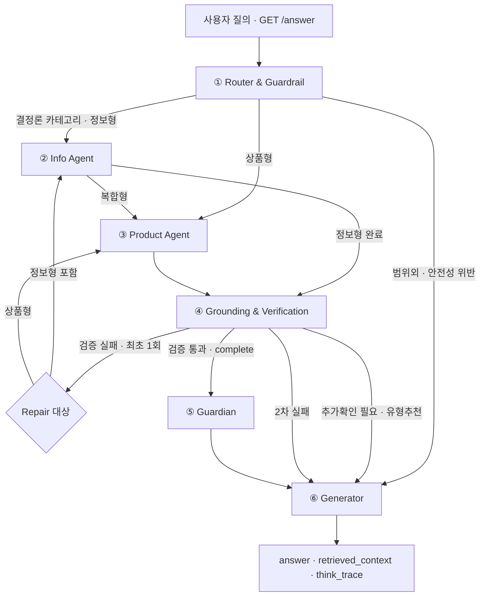

<div align="center">

# 🛡️ 연금 파수꾼 | Pension Guardian

### 모르는 사이에 잃는 연금 혜택과 잘못된 선택의 위험을 먼저 발견하는 AI Agent

**연금 제도·세제·상품 데이터를 근거로 답하고, 숫자는 규칙으로 계산하며, 검증된 경우에만 다음 행동을 안내합니다.**

제10회 2026 미래에셋증권 AI Festival · 연금 Agent(Pension Advisor)

</div>

---

## 🎯 Project Overview

연금 질문은 짧지만, 정확한 답변에 필요한 조건은 복잡합니다.

- 같은 연령이라도 **수령 방식·재원·종신연금 여부·연금수령연차**에 따라 세금이 달라질 수 있습니다.
- 같은 펀드라도 **판매 클래스·판매 채널·총보수**에 따라 장기 비용이 달라집니다.
- 중도인출·실물이전·퇴직금의 IRP 이전은 **세부 요건 하나**로 가능 여부가 달라질 수 있습니다.
- 세액공제 잔여 한도처럼 사용자가 먼저 묻지 않으면 **놓치기 쉬운 혜택**도 있습니다.

따라서 본 프로젝트는 단순히 문서를 검색해 답하는 RAG 챗봇이 아니라, **RAG + 구조화 DB + 결정론 규칙 엔진 + 검증 계층 + Guardian**을 결합한 정확성 중심 하이브리드 Agent로 설계했습니다.

| 설계 원칙 | 구현 방식 |
| --- | --- |
| 📚 제공 자료 우선 | 주최 측 제도 문서와 투자설명서를 Chroma·SQLite에 구조화 |
| 🧮 계산과 설명 분리 | 세금·한도·요건은 Python 규칙 엔진이 결정론적으로 계산 |
| 🚦 정보가 부족하면 멈춤 | 필수 조건을 검사하고 `needs_clarification` / `response_mode`로 답변 범위를 통제 |
| 🔍 답변 전 검증 | 수치·근거·전제·요구사항 충족 여부를 Grounding 단계에서 확인 |
| 🛡️ 검증 후 선제 안내 | Core Answer는 유지한 채, 놓친 손실·혜택·비용을 Guardian이 최대 1건만 추가 안내 |

### 💬 한 줄 정의

> **더 많은 답을 생성하는 Agent가 아니라, 틀리면 위험한 답은 멈추고 사용자가 놓칠 손실은 먼저 발견하는 Agent입니다.**

---

## 💡 Problem Definition

연금 의사결정에서 발생하는 사용자 손실을 세 가지로 정의했습니다.

| 문제 영역 | 사용자가 겪는 위험 | Pension Guardian의 역할 |
| --- | --- | --- |
| ⏳ 놓치면 사라지는 것 | 세액공제 잔여 한도·적용 기회를 놓침 | 확인된 납입정보로 미사용 혜택 탐지 |
| ⚠️ 잘못 건드리면 깨지는 것 | 연금외수령·중도인출·이전 과정에서 세금 또는 제한 발생 | 실행 전 재원·행동·상품 조건 점검 |
| 🔎 모르면 못 받는 것 | 가입 시점·수령연차·계좌 유형별 특례를 활용하지 못함 | 사용자 상황과 규칙을 연결해 적용 가능성 안내 |

기존 단일 RAG는 문서를 찾아 설명하는 데는 유용하지만, 조건이 많은 연금 세제 계산과 상품 적합성 판단을 일관되게 통제하기 어렵습니다. 본 프로젝트는 **설명형·계산형·비교형 데이터를 서로 다른 방식으로 처리**해 이 문제를 줄였습니다.

---

## 🔍 Development & Analysis Flow

| 단계 | 분석·개발 내용 | 핵심 산출물 |
| --- | --- | --- |
| 0️⃣ 환경 구축 | Python 환경, 저장소 구조, CLOVA Studio 연결 | 재현 가능한 실행 환경 |
| 1️⃣ 자료 검수 | 제도 문서 58개와 투자설명서 100개 전수 확인·라벨링 | 검색 키워드·원문 위치·분류 메타데이터 |
| 2️⃣ 파싱·정규화 | PDF·DOCX·XLSX·PPTX 및 투자설명서 표·서술 추출 | 제도문서 708청크, 상품 서술 430문서 |
| 3️⃣ 저장소 분리 | 설명형은 Chroma, 비교형 수치는 SQLite에 저장 | 100펀드·198클래스 상품 DB |
| 4️⃣ 규칙 엔진 | 세금·한도·이전·투자가능 여부를 순수 Python으로 구현 | 10개 규칙 모듈 |
| 5️⃣ Agent 배선 | Router → Info/Product → Grounding → Guardian → Generator | LangGraph 실행 그래프 |
| 6️⃣ 검증 강화 | 수치 대사·전제 교정·요구사항 검사·1회 Repair | L0 + L1 Grounding |
| 7️⃣ 파수꾼 구현 | 손실·혜택·비용을 검증 후 최대 1건 추가 안내 | 결정론적 Guardian |
| 8️⃣ 평가 반복 | 단위·API·E2E 테스트와 100/500문항 평가셋 운영 | 회귀 테스트·119개 점검포인트 |

### 🔁 단일 RAG에서 현재 구조로

| 테스트에서 발견한 한계 | 코드에 반영한 개선 |
| --- | --- |
| RAG가 세율·한도·예외 조건을 자연어로 추론 | 숫자와 요건을 규칙 엔진·구조화 조회로 분리 |
| 정확한 코드 매칭이 필요한 문서까지 의미 검색 | doc29·doc34를 RAG에서 분리해 구조화 판정 |
| 상품명이 DB에 있어도 잘못된 의도로 분류될 수 있음 | 코드 후보 생성 + HCX-007 판정 + 제한적 코드 보정 |
| 필수 정보가 없는데도 계산·추천을 단정 | 부족정보 Gate와 단계별 `response_mode` 적용 |
| LLM이 근거 없는 숫자를 생성 | L0 수치 대사와 미지원 수치 제거 |
| 검증 실패 시 반복 재생성 | `repair_attempted`로 Repair를 최대 1회로 제한 |
| 자유로운 후속 제안이 중복·과잉 권유로 변질 | 검증 완료 후 결정론적 Guardian이 최대 1건만 추가 |

---

## 🏗️ System Architecture



### 핵심 실행 규칙

1. `is_safe=False` 또는 `scope="범위외"`이면 전문 Agent를 호출하지 않고 정형 한계 안내를 생성합니다.
2. Router가 결정론 카테고리를 확정하면 Info Agent가 규칙 기반 경로를 우선 사용합니다.
3. 정보형은 Info Agent, 상품형은 Product Agent로 이동합니다.
4. 복합형은 **Info → Product 순차 실행**으로 제도 근거를 상품 판단에 전달합니다.
5. Product Agent의 조건부 응답·유형 추천도 Grounding을 거쳐, 일반 기준에 섞일 수 있는 근거 없는 수치를 검증합니다.
6. Grounding 실패 시 담당 Agent로 **최대 1회** 돌아가 수정합니다.
7. 검증을 통과한 `complete` 응답에만 Guardian이 실행됩니다.

---

## 🤖 Agent Details

### ① 🧭 Router & Guardrail

**Model:** `HCX-007` + Structured Outputs + `thinking={"effort": "none"}`

사용자 질문을 하나의 라벨로 단순 분류하지 않고 여러 축으로 동시에 판단합니다.

- `intent`: 정보형 / 상품형 / 복합형
- `scope`: 범위내 / 부분관련 / 범위외
- `is_safe`: 안전 가이드라인 통과 여부
- `deterministic_category`: 규칙 기반 처리가 가능한 카테고리 여부

분류는 **코드가 후보를 생성하고 HCX-007이 최종 판단하는 2단계 구조**입니다. 검증 과정에서 LLM이 명확한 후보를 잘못 기각한 사례가 확인된 카테고리에 대해서만, 처리 함수 자체의 안전한 매칭 조건을 전제로 제한적 코드 보정을 적용합니다.

### ② 📚 Info Agent

**Model:** `HCX-005` + ReAct + 5개 Agent Tool

연금 제도·세제·업무절차 질문을 처리합니다.

- Router가 확정한 결정론 카테고리는 규칙 경로를 우선 사용
- 세액공제·연금 인출·중도인출·디폴트옵션은 규칙 엔진 호출
- 일반 제도 설명은 `search_pension_docs`로 RAG 검색
- 계산 입력이 부족하면 값을 임의로 가정하지 않고 필요한 조건과 확인 가능한 일반 기준을 함께 제시

LLM은 **어떤 Tool을 어떤 순서로 사용할지 판단하고 자연어로 설명**하며, 틀리면 금전적 손실로 이어질 수 있는 수치 계산 자체는 규칙 엔진이 담당합니다.

### ③ 📊 Product Agent

**Model:** `HCX-005` + ReAct + 4개 Agent Tool

펀드 검색·비교·계좌별 편입 가능 여부·추천을 담당합니다.

- 정량 정보: 위험등급, 총보수, 수익률, AUM, 판매 클래스 → **SQLite**
- 정성 정보: 투자전략, 주요 위험, 투자목적 → **Chroma**
- 계좌 제약: DB/DC/IRP/연금저축의 상품 편입 가능 여부 → **규칙 판정**
- 추천: 상품 유형 추천과 실제 개별 펀드 추천을 단계적으로 분리

특정 펀드를 직접 묻거나 비교하는 질문은 추천 슬롯 수집을 거치지 않고 DB를 조회합니다.

### ④ 🔍 Grounding & Verification

**Model:** `HCX-007` + Structured Outputs + 코드 기반 L0 검증

Agent가 생성한 초안과 **실제로 호출한 Tool 결과**를 대조합니다.

#### L0 — 결정론적 수치 대사

- 답변에 등장하는 수치를 Tool 결과와 코드로 직접 비교
- 근거 어디에도 없는 숫자는 `find_unsupported_numbers`로 탐지
- 미지원 수치가 포함된 문장은 `enforce_unsupported_numbers`로 제거

#### L1 — 문장 타당성 검증

- `grounded`: 구체적 주장과 수치가 근거에 존재하는가
- `premise_issues`: 사용자의 잘못된 전제를 교정했는가
- `requirements_met`: 질문이 요구한 항목을 모두 답했는가
- `missing_requirements`: 빠진 요구사항은 무엇인가

근거 없는 단정에는 한계 고지를 강제하고, 잘못된 전제가 확인되면 정정 문장을 답변 앞부분에 반영합니다.

#### Bounded Repair

검증 실패 시 무한 반복하지 않고 `repair_attempted` 상태값으로 **최대 1회만 재생성**합니다. 1회 이후에도 통과하지 못하면 문제 부분을 제거하거나 한계를 명시한 형태로 Generator가 답변을 확정합니다.

### ⑤ 🛡️ Guardian

Grounding을 통과한 완결 답변에만 실행되는 **후단 안전 계층**입니다.

Guardian은 사용자가 질문하지 않았지만 지금 놓치면 손해가 될 수 있는 지점을 검사합니다.

**실행 Gate**

- `scope == "범위내"`
- `needs_clarification == False`
- `response_mode == "complete"`
- `grounded == True`
- `requirements_met == True`

**설계 원칙**

- Core Answer를 수정하지 않음
- 근거가 있는 후보만 사용
- 사용자가 이미 직접 물은 주제는 중복 안내하지 않음
- 최종적으로 **최대 1건**만 추가

#### Guardian이 보는 대표 후보

| 유형 | 탐지 내용 | 구현 방식 |
| --- | --- | --- |
| 💰 COST | 동일 펀드·동일 연금계좌에서 더 낮은 비용의 `STANDARD` 클래스 존재 | 동결된 Cost Guard 데이터 선조회 |
| ⚠️ ACTION | 퇴직금 재원을 연금외수령할 때 이연퇴직소득세 감면 상실 | 구조화된 재원·수령방식 판정 |
| 🔄 ACTION | 실물이전 절차 질문에서 상품별 이전 제한 가능성 | 실물이전 의도 + doc34 근거 |
| 🏠 ACTION | 주택구입·전월세보증금 중도인출에서 재원별 과세 확인 필요 | 중도인출 행동·서류 질의 판정 |
| 🎁 OPPORTUNITY | 제공된 납입정보로 확정 가능한 미사용 세액공제 한도 | 규칙 기반 잔여 한도 계산 |

> Cost Guard 후보는 별도 선조회하며, 그 외 일반 Guardian 후보는 코드 정의 우선순위에 따라 **세금상 손실(100) → 실물이전 제약(95) → 중도인출 과세(90) → 미사용 혜택(80)** 순으로 하나를 선택합니다.

### ⑥ ✍️ Generator

**Model:** `HCX-005`

최종 답변, 근거, 검증 결과와 실행 흐름을 조립합니다.

- `answer`: 사용자가 읽는 최종 답변
- `retrieved_context`: 실제 답변 근거
- `think_trace`: 분류 → Tool 호출 → 검증 → 조립 흐름
- 범위외·안전성 위반·예외 발생 시 정형 한계 안내

파이프라인에서 예외가 발생해도 평가 API가 무응답으로 종료되지 않도록, 가능한 범위에서 한계를 명시한 응답을 반환하도록 설계했습니다.

---

## 🧰 Tools & Rule Engine

### Agent Tools

| Tool | 사용 경로 | 역할 |
| --- | --- | --- |
| `calculate_tax_credit` | Info | 연금저축·IRP 세액공제 한도 및 공제액 계산 |
| `calculate_pension_withdrawal` | Info | 연금수령한도·퇴직소득세 감면·사적연금 과세를 종합한 인출 시뮬레이션 |
| `check_early_withdrawal` | Info | 중도인출 사유·기한·필요서류·세금 영향 점검 |
| `check_default_option` | Info | 디폴트옵션 옵트인 자격·상태 확인 |
| `check_in_kind_transfer` | 결정론 경로 | 상품 상태·불가사유 코드에 따른 실물이전 가능 여부 확인 |
| `check_product_pension_eligibility` | Product | 계좌·상품 유형별 편입 가능 여부 확인 |
| `search_pension_docs` | Info | 제도·세제·업무 문서 RAG 검색 |
| `search_funds` | Product | 위험등급·상품명·분류 조건으로 펀드 검색 |
| `get_fund_detail` | Product | 특정 펀드·클래스의 정량 정보 조회 |
| `search_prospectus_text` | Product | 투자전략·주요 위험 등 투자설명서 서술형 근거 검색 |

> 총 10개의 Tool 함수 중 **5개는 Info ReAct Agent**, **4개는 Product ReAct Agent**에 직접 바인딩되며, 실물이전 개별 판정은 별도의 결정론 경로에서 통제합니다.

### Rule Modules

```text
src/rules/
├── comprehensive_tax.py          # 사적연금 종합과세
├── default_option.py             # 디폴트옵션 판정
├── early_withdrawal.py           # 중도인출 요건·기한
├── in_kind_transfer.py           # 실물이전 가능 여부
├── investment_limit.py           # 계좌별 위험자산 투자한도
├── irp_mandatory_transfer.py     # 퇴직 시 IRP 의무이전
├── pension_withdrawal.py         # 연금수령 시나리오 통합 계산
├── retirement_tax_reduction.py  # 퇴직소득세 감면율
├── tax_credit.py                 # 세액공제
└── withdrawal_limit.py           # 연금수령한도
```

---

## 🗃️ Data Pipeline & Assets

### 데이터 성격별 처리 전략

| 데이터 성격 | 예시 | 처리 방식 |
| --- | --- | --- |
| 📖 설명형 | 연금 제도, 업무 절차, 상품 투자전략·위험 | Chroma RAG |
| 🧮 계산형 | 세액공제, 수령한도, 세율, 감면율 | Python Rule Engine |
| 📊 비교형 | 위험등급, 총보수, 수익률, AUM | SQLite 구조화 조회 |

### 📚 제도·세제 데이터

- 원본: PDF·DOCX·XLSX·PPTX 형식 문서 **58개**
- 전처리: `data/processed/chroma_docs/` **708청크**
- 임베딩: `clir-emb-dolphin`
- 메타데이터: 문서명·섹션·원문 위치 등 검색 근거 보존
- 별도 구조화:
  - `doc29_default_option_qa_lookup.json`
  - `doc34_in_kind_transfer_code_lookup.json`

`doc29`와 `doc34`는 의미 검색보다 정확한 문답·코드 매칭이 중요하므로 일반 RAG에서 제외하고 구조화 판정으로 분리했습니다.

### 📈 상품 데이터

- 원본: 펀드 투자설명서 PDF **100개**
- SQLite: `prospectus.db`
  - `fund_master`: **100개 펀드**
  - `fund_class`: **198개 판매 클래스**
- Chroma: `chroma_prospectus/` 투자전략·위험 등 **430개 서술 문서**
- 구조화 축: 상품분류 / 위험등급 / 판매클래스 / 총보수 / 수익률 / AUM
- AUM: 100개 중 **98개 수기검수 반영**

### 💰 Cost Guard Dataset

동일 펀드 내 연금계좌 판매 클래스의 비용을 비교하기 위해 별도의 **검수·동결 데이터셋**을 구축했습니다.

| 항목 | 값 |
| --- | ---: |
| 데이터 버전 | `cost_guard_v1` |
| 상태 | `FROZEN_V1` |
| 대상 펀드 | 64개 |
| 클래스 행 | 210개 |
| 표준 저비용 쌍 | 93개 |
| 채널 조건부 쌍 | 60개 |
| P0 검토 필요 케이스 | 44개 |
| 미해결 필드 | 0개 |

판매 채널이 달라 실제 가입 가능 여부를 추가 확인해야 하는 비교는 `CHANNEL_CONDITIONAL`로 분리합니다. Guardian의 자동 저비용 클래스 안내는 실제 실행 가능성을 보수적으로 보기 위해 **`STANDARD` 비교만 사용**합니다.

---

## 📁 Project Structure

> 아래는 최종 브랜치의 핵심 실행·검증 파일을 중심으로 정리한 구조입니다.

```text
📦 project-root
├── 📂 data/
│   ├── 📂 labels/                         # 문서 라벨링·메타데이터
│   └── 📂 processed/
│       ├── 📂 chroma_docs/                # 제도문서 708청크
│       ├── 📂 chroma_prospectus/          # 투자설명서 서술형 430문서
│       ├── 📄 prospectus.db               # 100펀드·198클래스 SQLite
│       ├── 📄 aum_report.csv
│       ├── 📄 doc29_default_option_qa_lookup.json
│       ├── 📄 doc34_in_kind_transfer_code_lookup.json
│       └── 📄 fund_class_pension*         # Cost Guard 검수·동결 데이터
│
├── 📂 src/
│   ├── 📂 agents/
│   │   ├── 📄 graph.py                    # LangGraph 배선·분기·Repair loop
│   │   ├── 📄 router.py                   # Intent·Scope·Safety·Category
│   │   ├── 📄 info_agent.py               # 제도·세제 Agent
│   │   ├── 📄 product_agent.py            # 상품 비교·추천 Agent
│   │   ├── 📄 deterministic_info.py       # 결정론 정보 응답
│   │   ├── 📄 grounding.py                # L1 Grounding
│   │   ├── 📄 verification.py             # L0 수치·전제 검증
│   │   ├── 📄 guardian.py                 # 후단 파수꾼
│   │   ├── 📄 generator.py                # 최종 응답 조립
│   │   ├── 📄 tools.py                    # 10개 Tool 래퍼
│   │   ├── 📄 state.py                    # 공유 State 스키마
│   │   ├── 📄 context.py                  # 컨텍스트 보조 로직
│   │   ├── 📄 tax_context.py              # 세금 질의 구조화 문맥
│   │   ├── 📄 withdrawal_context.py       # 인출 질의 구조화 문맥
│   │   ├── 📄 in_kind_transfer_intent.py  # 실물이전 의도 판정 보조
│   │   ├── 📄 query_rewrite.py            # 검색 질의 보강
│   │   └── 📄 llm.py                      # HyperCLOVA X 모델·재시도 설정
│   │
│   ├── 📂 api/
│   │   └── 📄 main.py                     # GET /answer · GET /health
│   ├── 📂 parsing/                         # PDF/DOCX/PPTX/XLSX·투자설명서 파싱
│   ├── 📂 rules/                           # 10개 결정론 규칙 모듈
│   └── 📂 storage/
│       ├── 📄 docs_vectorstore.py          # 제도문서 Chroma
│       ├── 📄 prospectus_vectorstore.py    # 상품 서술 Chroma
│       ├── 📄 prospectus_loader.py         # 상품 데이터 로딩
│       ├── 📄 cost_guard_loader.py         # Cost Guard 로딩·검증
│       ├── 📄 queries.py                   # SQLite 조회
│       └── 📄 schema.py                    # 구조화 DB 스키마
│
├── 📂 eval/
│   ├── 📄 eval_questions_100.csv
│   ├── 📄 eval_questions_500.csv
│   ├── 📄 checkpoints_119.csv
│   ├── 📄 run_eval.py
│   └── 📄 screen_results.py
│
├── 📂 tests/
│   ├── 📂 test_agents/
│   ├── 📂 test_api/
│   ├── 📂 test_e2e/
│   ├── 📂 test_parsing/
│   ├── 📂 test_rules/
│   ├── 📂 test_scripts/
│   └── 📂 test_storage/
│
├── 📂 scripts/                             # 파싱·검수·색인·로컬 대화 실행
├── 📄 Dockerfile
├── 📄 DEPLOY.md
├── 📄 HANDOFF.md
├── 📄 requirements.txt
└── 📄 README.md
```

---

## ✅ Test & Validation

### 평가 자산

- `eval_questions_100.csv`: 초기 핵심 질문셋
- `eval_questions_500.csv`: 제도·세제·상품·반례를 확장한 500문항 평가셋
- `checkpoints_119.csv`: 특정 문항에서 반드시 확인할 119개 판단 포인트
- `screen_results.py`: 평가 결과 선별·점검 보조
- `tests/test_e2e/`: 실제 모델 호출 기반 E2E 회귀 테스트

### 평가 관점

| 기준 | 점검 내용 |
| --- | --- |
| 🎯 정확성 | 제도·세제·상품 사실과 계산 결과가 일치하는가 |
| 🔗 근거성 | 답변의 구체적 주장과 수치가 실제 Tool 결과에 있는가 |
| 🧭 라우팅 | 정보·상품·복합 질문이 올바른 경로를 통과하는가 |
| 🧩 충족성 | 여러 항목을 물었을 때 빠짐없이 답했는가 |
| 🚦 정보 충분성 | 입력이 부족할 때 임의의 전제를 만들지 않았는가 |
| 🪤 전제 교정 | 잘못된 제도·위험등급 전제를 먼저 바로잡았는가 |
| 🛡️ 안전성 | 근거 없는 수치·단정·범위 밖 답변을 방어하는가 |
| 💬 이해 가능성 | 어려운 금융 용어를 사용자 관점에서 설명하는가 |

### 대표 Behavior Test

```text
“나 74세인데 연금 세금은 얼마야?”
→ 연령 하나만으로 확정하지 않고 수령 방식·재원·연간 과세대상 소득·수령연차 등 필요한 조건을 확인

“위험등급 6등급이 1등급보다 더 위험하지?”
→ 잘못된 위험등급 방향을 먼저 교정

“IRP 상품은 모두 원금 보장이지?”
→ 계좌와 편입 상품의 위험을 분리해 설명

“만기된 펀드는 무조건 실물이전할 수 있어?”
→ 상품 상태와 doc34 불가사유 코드를 기준으로 판정
```

### 테스트 실행

```bash
# 네트워크 호출 없는 전체 테스트
pytest -q

# 실제 HyperCLOVA X를 호출하는 E2E 회귀 테스트
RUN_LIVE_AGENT_TESTS=1 pytest tests/test_e2e -v
```

> 단위 테스트만으로는 “답할 수 있는 질문을 거부하는 문제” 같은 전체 파이프라인 결함을 놓칠 수 있어, 제출 전 Live E2E를 함께 확인합니다.

---

## ⚒️ Tech Stack

| 영역 | 기술 | 프로젝트 내 역할 |
| --- | --- | --- |
| 🧠 LLM | HyperCLOVA X `HCX-007` | Router·Grounding의 Structured Outputs |
| 💬 LLM | HyperCLOVA X `HCX-005` | Info/Product Tool Calling·Generator |
| 🔗 Embedding | `clir-emb-dolphin` | 제도·상품 서술 문서 임베딩 |
| 🔄 Orchestration | LangGraph, LangChain | 상태 기반 분기·순차 오케스트레이션·ReAct Agent |
| 🧮 Logic | Python Rule Engine | 세금·한도·이전·적합성 계산 |
| 🗄️ Vector DB | Chroma | 제도문서·투자설명서 서술 검색 |
| 🧱 Structured DB | SQLite | 상품·클래스·비용 비교 |
| 🚀 API | FastAPI, Uvicorn, Pydantic | 대회 평가용 API와 응답 스키마 |
| 🐳 Deploy | Docker | 환경 독립적 실행·배포 |
| 🧪 Test | pytest, httpx | 규칙·Agent·API·E2E 회귀 검증 |

### HyperCLOVA X 모델 분리 이유

- `HCX-007`: Router·Grounding처럼 구조화된 판단이 필요한 단계에 사용
- `HCX-005`: Function Calling 기반 Tool 사용과 최종 자연어 생성에 사용
- Structured Outputs / Tool 사용 시 모델 제약에 맞게 Thinking과 `parallel_tool_calls` 설정을 통제
- 복합 질문은 병렬 실행이 아니라 Info 결과를 Product가 이어받는 **순차 실행**
- 모델 호출은 공통 LLM 래퍼의 재시도 정책을 거쳐 일시적 API 오류와 Rate Limit에 대응

---

## 🚀 Quick Start

### 1. 가상환경 생성

```bash
python -m venv .venv

# macOS / Linux
source .venv/bin/activate

# Windows cmd
.venv\Scripts\activate

# Windows PowerShell
.venv\Scripts\Activate.ps1
```

> ⚠️ `.venv`는 OS별 바이너리가 포함되므로 공유하지 않습니다. 각 환경에서 새로 생성하세요.

### 2. 의존성·환경변수 설정

```bash
pip install -r requirements.txt
cp .env.sample .env
```

`.env`에 CLOVA Studio API Key를 설정합니다.

```env
CLOVASTUDIO_API_KEY=your_api_key
```

### 3. 로컬 대화 실행

```bash
python scripts/chat.py
```

### 4. API 서버 실행

```bash
uvicorn src.api.main:app --host 0.0.0.0 --port 8000
```

### 5. Docker 실행

```bash
docker build -t pension-agent .
docker run -p 8000:8000 --env-file .env pension-agent
```

> 🔐 API Key는 이미지에 포함하지 않고 실행 시 환경변수로 주입합니다. 구축된 `data/processed/` 자산은 저장소에 포함되어 있어 일반 실행 시 별도 재색인이 필요하지 않습니다.

---

## 🌐 Evaluation API

### Health Check

```bash
curl http://localhost:8000/health
```

### Answer

```bash
curl -G "http://localhost:8000/answer" \
  --data-urlencode "question_id=Q-001" \
  --data-urlencode "question=연금저축과 IRP에 넣으면 세액공제는 얼마까지 되나요?"
```

### Response Schema

```json
{
  "question_id": "Q-001",
  "question": "사용자 질문",
  "retrieved_context": "답변에 사용한 근거",
  "think_trace": "분류·도구·검증·조립 과정",
  "answer": "최종 답변"
}
```

> ⚠️ Windows Git Bash의 `curl`은 한글 인코딩 문제가 발생할 수 있어, 한글 질의 테스트에는 Python `requests` 또는 `urllib` 사용을 권장합니다.

---

## 💬 Example Flow

### “퇴직금을 일시금으로 받고 싶은데 절차가 어떻게 되나요?”

```text
사용자 질문
   ↓
Router: 연금 범위 내 정보형 질의로 분류
   ↓
Info Agent: 관련 제도·절차 근거 검색
   ↓
Grounding: 답변의 근거·수치·요구사항 검증
   ↓
Guardian: 퇴직금 재원 + 연금외수령 행동을 구조적으로 확인
   ↓
Core Answer는 그대로 유지하고,
연금으로 받을 때 적용될 수 있는 이연퇴직소득세 감면을 놓칠 수 있다는 점을 1건 추가 안내
```

Guardian은 사용자의 질문을 대신 바꾸거나 다른 상품을 자유롭게 추천하지 않습니다. **질문에 대한 정확한 답을 먼저 완성한 뒤**, 검증된 규칙으로 놓친 위험이나 혜택만 덧붙입니다.

---

## ✨ What Makes It Different

| 일반적인 연금 RAG 챗봇 | 🛡️ Pension Guardian |
| --- | --- |
| 검색 문서를 요약해 바로 답변 | Router가 의도·범위·안전·결정론 경로를 먼저 판정 |
| LLM이 숫자와 조건을 자연어로 추론 | 규칙 엔진이 계산하고 L0 검증기가 수치를 대사 |
| 하나의 Agent가 제도와 상품을 모두 처리 | Info / Product Agent 분리, 복합형만 순차 연결 |
| 정보가 부족해도 평균적 상황을 가정 | 필수 조건 Gate와 조건부 응답으로 단정 방지 |
| 검증 실패 시 그대로 출력하거나 반복 | L0/L1 Grounding 후 최대 1회 Repair |
| 자유로운 후속 추천 | 검증된 Guardian 후보 중 최대 1건만 추가 |
| 판매 클래스 비용을 단순 비교 | 동결된 Cost Guard + 채널 조건을 함께 점검 |
| 답변만 반환 | 사용 근거와 실행 흐름을 `retrieved_context`·`think_trace`로 제공 |

### 핵심 차별점 3가지

1. **LLM이 계산하지 않는 연금 Agent** — 틀리면 위험한 수치·요건은 규칙 엔진과 구조화 DB가 담당합니다.
2. **답변 생성보다 검증을 우선하는 Agent** — 부족정보 Gate, L0/L1 Grounding, bounded repair로 할루시네이션을 방어합니다.
3. **질문 밖의 손실까지 보는 Guardian** — 검증된 Core Answer 이후에만, 사용자가 놓친 손실·혜택·비용을 최대 1건 선제 안내합니다.

---

## 🔭 Limitations & Future Work

- 법령·세제 개정 시 규칙 버전과 기준일을 자동 갱신하는 체계
- 외부 API를 답변 근거가 아닌 **정책 변화 감지 Trigger**로 활용하는 검증 파이프라인
- 투자설명서 개정 시 SQLite·Chroma·Cost Guard 자동 재추출 및 변경 대조
- 판매 채널·가입 자격까지 반영한 클래스 비용 비교 고도화
- 운영 중 실패 사례를 평가셋과 회귀 테스트에 자동 편입
- 복잡하거나 고위험한 질의를 Human-in-the-loop로 연결

---

## 🔗 References

- 최신 구현 기준: [Pension Agent — `integration/agent-best-of-three`](https://github.com/jinuuuuuuuuuuu/test1/tree/integration/agent-best-of-three)
- README 구성 참고: [투자대법관 FIN문철 — 제9회 미래에셋증권 AI Festival](https://github.com/yoonwanggyu/MIRAE_ASSET_AI-Festival)

> 본 프로젝트의 제도·세제·상품 안내는 구축 데이터와 규칙의 기준 시점에 따릅니다. 실제 금융 의사결정 전에는 최신 법령과 금융회사 안내를 추가로 확인해야 합니다.
