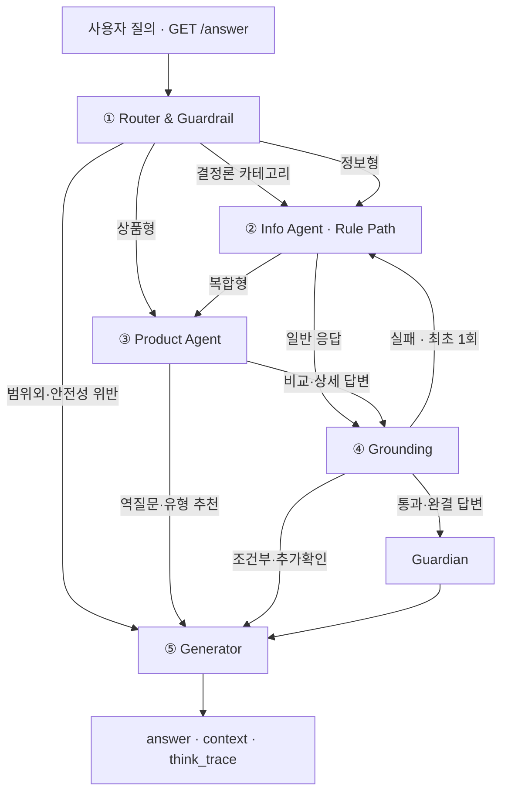

<div align="center">

# 🛡️ 연금 파수꾼 | Pension Guardian

### 모르는 사이에 잃는 연금 혜택과 잘못된 선택의 위험을 먼저 발견하는 AI Agent

**연금 제도·세제·상품 데이터를 근거로 답하고, 숫자는 규칙으로 계산하며, 검증된 경우에만 다음 행동을 제안합니다.**

제10회 2026 미래에셋증권 AI Festival · 연금 Agent(Pension Advisor)

</div>


---

## 🎯 Project Overview

연금 질문은 짧지만 정확한 답변에 필요한 조건은 복잡합니다.

- 같은 나이라도 **수령 방식·재원·종신연금 여부·연금수령연차**에 따라 세금이 달라집니다.
- 같은 펀드라도 **판매 클래스·판매 채널·총보수**에 따라 장기 비용이 달라집니다.
- 중도인출·실물이전·퇴직금의 IRP 이전은 **세부 요건 하나**로 가능 여부가 바뀔 수 있습니다.
- 세액공제 잔여 한도처럼 사용자가 먼저 묻지 않으면 놓칠 수 있는 혜택도 있습니다.

따라서 본 프로젝트는 단순 RAG 챗봇이 아니라 다음 원칙을 적용한 **정확성 중심 하이브리드 Agent**로 설계했습니다.

| 원칙 | 구현 방식 |
| --- | --- |
| 📚 제공 자료 우선 | 주최 측 문서와 투자설명서를 Chroma·SQLite에 구축 |
| 🧮 계산과 설명 분리 | 세금·한도·요건은 Python 규칙 엔진이 결정론적으로 계산 |
| 🚦 정보가 부족하면 멈춤 | 단일턴 평가에 맞춰 부족한 입력 전체를 한 번에 확인 |
| 🔍 답변 전 검증 | 수치·근거·전제·요구사항 충족 여부를 Grounding 단계에서 확인 |
| 🛡️ 검증 후 선제 안내 | Core Answer를 바꾸지 않고 Guardian이 최대 1개의 추가 점검만 제공 |

### 💬 한 줄 정의

> **더 많은 답을 생성하는 Agent가 아니라, 틀리면 위험한 답은 멈추고 사용자가 놓칠 손실은 먼저 발견하는 Agent입니다.**

---

## 💡 Problem Definition

연금 의사결정에서 발생하는 사용자 손실을 세 가지로 정의했습니다.

| 문제 영역 | 사용자가 겪는 위험 | Agent의 역할 |
| --- | --- | --- |
| ⏳ 놓치면 사라지는 것 | 세액공제 잔여 한도와 기한을 놓침 | 확인된 납입액을 기준으로 미사용 혜택 탐지 |
| ⚠️ 잘못 건드리면 깨지는 것 | 연금외수령·중도인출·이전 과정에서 세금 또는 제한 발생 | 실행 전에 재원·행동·상품 조건 점검 |
| 🔎 모르면 못 받는 것 | 가입 시점·수령연차·계좌 유형별 특례를 활용하지 못함 | 사용자 상황과 규칙을 연결해 적용 가능성 안내 |

기존의 단일 RAG는 문서를 찾아 설명하는 데는 유용하지만, 조건이 많은 연금 세제 계산과 상품 적합성 판단을 일관되게 통제하기 어렵습니다. 본 프로젝트는 이를 해결하기 위해 **RAG + 구조화 DB + 규칙 엔진 + 다단계 검증**을 결합했습니다.

---

## 🔍 Development & Analysis Flow

| 단계 | 분석·개발 내용 | 핵심 산출물 |
| --- | --- | --- |
| 0️⃣ 환경 구축 | Python 환경, 저장소 구조, CLOVA Studio 연결 | 재현 가능한 실행 환경 |
| 1️⃣ 자료 검수 | 제공 문서 58개와 투자설명서 100개 전수 확인·라벨링 | 문서 분류·검색 키워드·원문 위치 |
| 2️⃣ 파싱·정규화 | PDF·DOCX·XLSX·PPTX와 투자설명서 표·서술 추출 | 제도문서 708청크, 상품 서술 430문서 |
| 3️⃣ 이중 저장소 | 설명형 문서는 Chroma, 비교형 수치는 SQLite에 저장 | 100펀드·198클래스 상품 DB |
| 4️⃣ 규칙 엔진 | 세금·한도·이전·투자가능 여부를 순수 Python으로 구현 | 10개 규칙 모듈 |
| 5️⃣ Agent 배선 | Router → Info/Product → Grounding → Guardian → Generator | LangGraph 실행 그래프 |
| 6️⃣ 검증 강화 | 수치 대사, 전제 교정, 요구사항 검사, 1회 Repair | L0 + LLM Grounding |
| 7️⃣ 파수꾼 구현 | 손실·기회·비용을 검증 후 최대 1건 추가 안내 | 결정론적 Guardian |
| 8️⃣ 평가 반복 | 단위·API·E2E 테스트와 100/500문항 평가셋 운영 | 회귀 테스트·119개 점검포인트 |

### 🔁 단일 RAG에서 현재 구조로

| 테스트에서 발견한 한계 | 코드에 반영한 개선 |
| --- | --- |
| RAG가 세율·한도·예외 조건을 자연어로 추론 | 숫자와 요건을 규칙 엔진·구조화 조회로 분리 |
| 비슷한 이름의 구 제도 문서가 검색되어 오답 가능 | 문서 적격성 확인 및 구 제도 오용 금지 |
| 상품명이 DB에 있어도 정보형으로 오분류되어 조회 실패 | DB 매칭 사실을 이용한 Router 코드 오버라이드 |
| 필수 정보가 없는데도 특정 상품을 추천 | 추천 슬롯과 단계별 응답 모드 도입 |
| LLM이 툴을 호출하지 않고 숫자를 생성 | 강제 RAG 폴백과 미지원 수치 제거 로직 추가 |
| 검증 실패 시 무한 재시도 가능 | `repair_attempted`로 Repair를 1회로 제한 |
| 자유로운 후속 제안이 중복·과잉 권유로 변질 | 우선순위 기반 Guardian이 최대 1건만 추가 |

---

## 🏗️ System Architecture


> 확대·편집용 벡터 원본: [`pension-agent-architecture.svg`](./pension-agent-architecture.svg)

### 🗺️ 전체 실행 흐름



### 핵심 라우팅 규칙

1. `is_safe=False` 또는 `scope="범위외"`이면 전문 Agent를 호출하지 않고 정형 한계 안내를 생성합니다.
2. Router가 결정론 카테고리를 확정하면 Info Agent가 LLM 대신 규칙 기반 답변을 우선 생성합니다.
3. 정보형은 Info Agent, 상품형은 Product Agent로 이동합니다.
4. 복합형은 **Info → Product 순차 실행**으로 제도 근거를 상품 판단에 전달합니다.
5. 정보가 부족하거나 상품 유형 수준의 추천만 필요한 경우 Grounding 또는 Guardian을 불필요하게 거치지 않습니다.
6. Grounding 실패 시 담당 Agent로 **최대 1회** 돌아가 수정합니다.
7. 검증된 `complete` 응답에만 Guardian이 실행됩니다.

---

## 🤖 Agent Details

### ① 🧭 Router & Guardrail

**Model:** `HCX-007` + Structured Outputs + `thinking={"effort": "none"}`

사용자 질문을 하나의 라벨로 단순 분류하지 않고 여러 축으로 동시에 판단합니다.

- `intent`: 정보형 / 상품형 / 복합형
- `scope`: 범위내 / 부분관련 / 범위외
- `is_safe`: 안전 가이드라인 통과 여부
- `deterministic_category`: 19개 결정론적 답변 카테고리 중 하나

LLM 분류 오류가 실제 DB 사실과 충돌할 때는 코드가 다음 항목을 보정합니다.

- 보유 상품명 매칭 시 상품형 의도 복원
- 위험등급·총보수 등 조건검색 의도 보정
- 실물이전 질문의 개별 판정 의도 보정
- 과도한 안전 차단과 카테고리 충돌 보정
- 결정론 정보 질문에서 불필요한 상품형 제거

### ② 📚 Info Agent

**Model:** `HCX-005` + ReAct + 5개 Agent Tool

연금 제도·세제 질문을 처리합니다.

1. Router가 확정한 결정론 카테고리가 있으면 규칙 답변을 먼저 생성합니다.
2. 그 외 질문은 RAG·계산 Tool을 사용해 답변 초안을 작성합니다.
3. 툴 호출 없이 근거가 비면 `search_pension_docs`를 강제로 한 번 실행합니다.
4. 계산 입력이 부족하면 현재 확인된 조건, 일반 기준, 부족한 정보와 질문을 한 답변에 모두 제공합니다.
5. 이전 문맥이 없는 “그거 다시 계산해줘” 같은 질문은 값을 추측하지 않습니다.

### ③ 📊 Product Agent

**Model:** `HCX-005` + ReAct + 4개 Agent Tool

펀드의 검색·비교·적합성·추천을 담당합니다.

- 정량 정보: 위험등급, 보수, 수익률, AUM, 판매 클래스
- 정성 정보: 투자전략, 주요 위험, 투자설명서 서술 근거
- 계좌 제약: DB/DC/IRP/연금저축의 상품 편입 가능성과 위험자산 한도
- 추천 입력: 계좌유형, 위험성향, 투자기간, 투자금액, 투자목적

추천은 **2단계**로 구분합니다.

```text
조건 수집 → 상품 유형 추천 → 사용자가 구체 추천 요청 → 실제 상품 후보 검색·비교
```

특정 상품을 바로 묻거나 비교하는 질문은 추천 슬롯 수집을 거치지 않고 DB를 직접 조회합니다. 실제 후보 속성에서 확인된 주식형·채권형·외화 노출 가능성만 시나리오 점검에 사용하며, 근거 없는 시장 전망은 제거합니다.

### ④ 🔍 Grounding & Verification

**Model:** `HCX-007` + Structured Outputs + 코드 기반 L0 검증

Info/Product Agent의 초안과 실제 툴 근거를 대조합니다.

- `grounded`: 구체적 주장과 수치가 근거에 존재하는가
- `unsupported_numbers_confirmed`: 실제 근거에 없는 수치가 있는가
- `premise_issues`: 사용자의 잘못된 전제를 교정했는가
- `requirements_met`: 질문이 요구한 항목을 모두 답했는가
- `missing_requirements`: 빠진 요구사항이 무엇인가

검증 실패 시 같은 Agent를 무한 반복하지 않고 `repair_attempted` 상태값으로 **1회만 수정**합니다. 결정론 답변은 불필요한 LLM 재검증을 생략하되, 과장된 세금 전제는 코드로 별도 탐지합니다.

### ⑤ 🛡️ Guardian

Grounding을 통과한 완결 답변에만 실행되는 **후단 안전 계층**입니다.

- Core Answer는 수정하지 않습니다.
- 근거가 완성된 후보만 사용합니다.
- 사용자가 이미 물은 주제는 중복 안내하지 않습니다.
- 여러 후보가 있어도 우선순위가 가장 높은 **1건만** 추가합니다.

| 우선순위 | Guard | 탐지 내용 |
| ---: | --- | --- |
| 100 | 연금외수령 손실 | 퇴직금 재원과 연금외수령 행동이 모두 확인된 경우 |
| 95 | 실물이전 제약 | 실물이전 절차 질문에서 상품별 제한 확인 필요 |
| 90 | 중도인출 과세 | 재원별 과세 차이를 확인해야 하는 행동 질문 |
| 80 | 미사용 세액공제 한도 | 제공된 납입액으로 잔여 한도를 확정할 수 있는 경우 |
| 70 | 저비용 클래스 | 검수 완료된 동일 펀드·계좌의 저비용 클래스가 존재하는 경우 |

### ⑥ ✍️ Generator

**Model:** `HCX-005`

최종 답변, 근거, 검증 결과와 도구 실행 과정을 조립합니다.

- `answer`: 사용자가 읽는 최종 답변
- `retrieved_context`: 실제 답변 근거
- `think_trace`: 분류 → Tool 호출 → 검증 → 조립 과정
- 안전성 위반·범위외·예외 발생 시 정형 한계 안내

파이프라인에서 예외가 발생해도 평가 API가 무응답으로 종료되지 않도록, 한계를 명시한 응답과 원인을 `think_trace`에 남깁니다.

---

## 🧰 Tools & Rule Engine

### Agent Tools

| Tool | 사용 경로 | 역할 |
| --- | --- | --- |
| `calculate_tax_credit` | Info | 연금저축·IRP 세액공제 계산 |
| `calculate_pension_withdrawal` | Info | 수령한도·퇴직소득세 감면·사적연금 과세를 함께 계산 |
| `check_early_withdrawal` | Info | 중도인출 사유·기한·필요서류·세금 영향 점검 |
| `check_default_option` | Info | 디폴트옵션 자동매수·옵트인 조건 확인 |
| `check_in_kind_transfer` | 결정론 경로 | 상품 상태에 따른 실물이전 가능 여부 확인 |
| `check_product_pension_eligibility` | Product | 계좌별 상품유형 투자 가능 여부 확인 |
| `search_pension_docs` | Info | 제도·세제·업무 문서 RAG 검색 |
| `search_funds` | Product | 위험등급·상품명·분류 조건으로 펀드 검색 |
| `get_fund_detail` | Product | 특정 펀드·클래스의 정량 정보 조회 |
| `search_prospectus_text` | Product | 특정 상품의 투자전략·위험 등 서술형 검색 |

> 총 10개의 Tool 함수 중 5개는 Info ReAct Agent, 4개는 Product ReAct Agent에 직접 바인딩되며, 실물이전 개별 판정은 별도의 결정론 경로에서 통제합니다.

### Rule Modules

```text
src/rules/
├── comprehensive_tax.py          # 사적연금 종합과세
├── default_option.py             # 디폴트옵션 판정
├── early_withdrawal.py           # 중도인출 요건·기한
├── in_kind_transfer.py           # 실물이전 가능 여부
├── investment_limit.py           # 계좌별 위험자산 투자한도
├── irp_mandatory_transfer.py     # 퇴직 시 IRP 의무이전
├── pension_withdrawal.py         # 연금수령 시나리오 통합 계산
├── retirement_tax_reduction.py  # 퇴직소득세 감면율
├── tax_credit.py                 # 세액공제
└── withdrawal_limit.py           # 연금수령한도
```

---

## 🗃️ Data Assets

### 📚 제도·세제 데이터

- 원본: PDF·DOCX·XLSX·PPTX 형식 문서 **58개**
- 전처리 결과: `data/processed/chroma_docs/` **708청크**
- 임베딩: `clir-emb-dolphin`
- 메타데이터: 문서명, 섹션, 원문 위치, 청크 ID
- 별도 구조화:
  - `doc29_default_option_qa_lookup.json`
  - `doc34_in_kind_transfer_code_lookup.json`

doc29·doc34는 의미 검색보다 정확한 코드·문답 매칭이 중요하므로 일반 RAG에서 제외하고 구조화 조회로 분리했습니다.

### 📈 상품 데이터

- 원본: 펀드 투자설명서 PDF **100개**
- SQLite: `prospectus.db`
  - `fund_master`: 100개 펀드
  - `fund_class`: 198개 판매 클래스
- Chroma: `chroma_prospectus/` 투자전략·위험 등 **430개 서술 문서**
- 구조화 축: 상품분류 / 위험등급 / 판매클래스 / 총보수 / 수익률 / AUM
- AUM: 100개 중 98개 수기검수 반영

### 💰 Cost Guard Dataset

동일 펀드 내 연금계좌 판매 클래스의 비용을 비교하기 위해 별도의 검수·동결 데이터셋을 구축했습니다.

| 항목 | 값 |
| --- | ---: |
| 데이터 버전 | `cost_guard_v1` |
| 상태 | `FROZEN_V1` |
| 대상 펀드 | 64개 |
| 클래스 행 | 210개 |
| 비교 가능한 펀드 | 44개 |
| 표준 저비용 쌍 | 93개 |
| 채널 조건부 쌍 | 60개 |
| 미해결 필드 | 0개 |

판매 채널이 달라 가입 가능 여부를 추가 확인해야 하는 쌍은 `CHANNEL_CONDITIONAL`로 분리해, Guardian이 무조건 더 저렴하다고 권유하지 않도록 제한합니다.

---

## 📁 Project Structure

```text
📦 project-root
├── 📂 data/
│   ├── 📂 processed/
│   │   ├── 📂 chroma_docs/                # 제도문서 708청크
│   │   ├── 📂 chroma_prospectus/          # 투자설명서 서술형 430문서
│   │   ├── 📄 prospectus.db               # 100펀드·198클래스
│   │   ├── 📄 doc29_default_option_qa_lookup.json
│   │   ├── 📄 doc34_in_kind_transfer_code_lookup.json
│   │   └── 📄 fund_class_pension*.csv/json # Cost Guard 검수·동결 데이터
│   └── 📂 labels/                          # 라벨링 메타데이터 위치
├── 📂 src/
│   ├── 📂 agents/
│   │   ├── 📄 graph.py                    # LangGraph 배선·분기·Repair
│   │   ├── 📄 router.py                   # Intent·Scope·Safety·Category
│   │   ├── 📄 info_agent.py               # 제도·세제 Agent
│   │   ├── 📄 product_agent.py            # 상품 비교·추천 Agent
│   │   ├── 📄 deterministic_info.py       # 결정론 정보 응답
│   │   ├── 📄 grounding.py                # 근거·요구사항 검증
│   │   ├── 📄 verification.py             # L0 수치·전제 검증
│   │   ├── 📄 guardian.py                 # 후단 파수꾼
│   │   ├── 📄 generator.py                # 최종 답변·think_trace
│   │   ├── 📄 tools.py                    # 10개 Tool 래퍼
│   │   └── 📄 state.py                    # 공유 State 스키마
│   ├── 📂 api/
│   │   └── 📄 main.py                     # GET /answer · GET /health
│   ├── 📂 parsing/                         # 위험등급·AUM·표 추출
│   ├── 📂 rules/                           # 10개 결정론 규칙 모듈
│   └── 📂 storage/                         # Chroma·SQLite·CostGuard 조회
├── 📂 eval/
│   ├── 📄 eval_questions_100.csv
│   ├── 📄 eval_questions_500.csv
│   ├── 📄 checkpoints_119.csv
│   └── 📄 run_eval.py
├── 📂 tests/
│   ├── 📂 test_agents/
│   ├── 📂 test_api/
│   ├── 📂 test_e2e/
│   ├── 📂 test_parsing/
│   ├── 📂 test_rules/
│   └── 📂 test_storage/
├── 📂 scripts/                             # 파싱·검수·색인·대화 실행
├── 📄 Dockerfile
├── 📄 DEPLOY.md
├── 📄 requirements.txt
└── 📄 README.md
```

---

## ✅ Test & Validation

### 평가 자산

- `eval_questions_100.csv`: 초기 핵심 질문셋
- `eval_questions_500.csv`: 제도·세제·상품·반례를 확장한 500문항 평가셋
- `checkpoints_119.csv`: 특정 문항에서 반드시 확인할 119개 판단 포인트
- `tests/test_e2e/`: 대회 참고 질의를 실제 모델로 확인하는 Live E2E 테스트

### 평가 기준

| 기준 | 점검 내용 |
| --- | --- |
| 🎯 정확성 | 제도·세제·상품 사실과 계산 결과가 일치하는가 |
| 🔗 근거성 | 답변의 구체적 주장과 수치가 실제 Tool 결과에 있는가 |
| 🧭 라우팅 | 정보·상품·복합 질문이 올바른 경로를 통과하는가 |
| 🧩 충족성 | 여러 항목을 물었을 때 빠짐없이 답했는가 |
| 🚦정보 충분성 | 입력이 부족할 때 임의로 가정하지 않았는가 |
| 🪤 전제 교정 | 잘못된 전제와 위험등급 방향을 바로잡았는가 |
| 🛡️ 안전성 | 단정적 추천·근거 없는 수치·범위 밖 답변을 차단했는가 |
| 💬 이해 가능성 | 어려운 금융 용어를 사용자 관점에서 설명했는가 |

### 대표 검증 질문

```text
“나 74세인데 연금 세금은 얼마야?”
→ 나이만으로 확정하지 않고 수령 방식·재원·종신연금·연간 수령액·수령연차 확인

“위험등급 6등급이 1등급보다 더 위험하지?”
→ 등급 방향의 잘못된 전제를 먼저 교정

“IRP 상품은 모두 원금 보장이지?”
→ 계좌와 편입 상품의 위험을 분리해 설명

“만기된 펀드는 무조건 실물이전할 수 있어?”
→ 상품 유형·상태와 doc34 불가사유 코드를 확인
```

### 테스트 실행

```bash
# 네트워크 호출 없는 전체 테스트
pytest -q

# 실제 HyperCLOVA X를 호출하는 E2E 회귀 테스트
RUN_LIVE_AGENT_TESTS=1 pytest tests/test_e2e -v
```

> 단위 테스트만으로는 “답할 수 있는 질문을 거부하는 문제” 같은 전체 파이프라인 결함을 놓칠 수 있으므로, 제출 전 Live E2E를 함께 실행합니다.

---

## ⚒️ Tech Stack

| 영역 | 기술 | 프로젝트 내 역할 |
| --- | --- | --- |
| 🧠 LLM | HyperCLOVA X `HCX-007` | Router·Grounding의 구조화 출력 |
| 💬 LLM | HyperCLOVA X `HCX-005` | Info/Product Tool Calling·Generator |
| 🔗 Embedding | `clir-emb-dolphin` | 제도·상품 서술 문서 임베딩 |
| 🔄 Orchestration | LangGraph, LangChain | 상태 기반 분기와 ReAct Agent 구성 |
| 🧮 Logic | Python Rule Engine | 세금·한도·이전·적합성 계산 |
| 🗄️ Vector DB | Chroma | 제도문서와 투자설명서 서술 검색 |
| 🧱 Structured DB | SQLite, SQLAlchemy | 상품·클래스·비용 비교 |
| 🚀 API | FastAPI, Uvicorn, Pydantic | 대회 평가용 API와 응답 스키마 |
| 🐳 Deploy | Docker | OS와 무관한 실행 환경 |
| 🧪 Test | pytest, httpx | 규칙·Agent·API·E2E 회귀 검증 |

### CLOVA Studio 모델 분리 이유

- `HCX-007`은 구조화 출력에 사용하며 Thinking을 끕니다.
- `HCX-005`는 Function Calling 기반 Tool 사용과 최종 답변 생성에 사용합니다.
- LangChain이 자동으로 넣는 `parallel_tool_calls`는 CLOVA Studio가 지원하지 않아 비활성화합니다.
- 복합형 질문은 병렬 실행이 아니라 Info 근거를 Product가 이어받는 **순차 실행**입니다.

---

## 🚀 Quick Start

### 1. 가상환경 생성

```bash
python -m venv .venv

# macOS / Linux
source .venv/bin/activate

# Windows cmd
.venv\Scripts\activate

# Windows PowerShell
.venv\Scripts\Activate.ps1
```

> ⚠️ `.venv`는 OS별 바이너리가 포함되므로 공유하지 않습니다. 각 환경에서 새로 생성하세요.

### 2. 의존성·환경변수 설정

```bash
pip install -r requirements.txt
cp .env.sample .env
```

`.env`에 다음 값을 설정합니다.

```env
CLOVASTUDIO_API_KEY=your_api_key
```

### 3. 로컬 대화 실행

```bash
python scripts/chat.py
```

### 4. API 서버 실행

```bash
uvicorn src.api.main:app --host 0.0.0.0 --port 8000
```

### 5. Docker 실행

```bash
docker build -t pension-agent .
docker run -p 8000:8000 --env-file .env pension-agent
```

> 🔐 API 키는 이미지에 포함하지 않고 실행 시 환경변수로 주입합니다. `data/processed/`의 구축 완료 데이터는 저장소에 포함되어 있어 별도 재색인 없이 실행할 수 있습니다.

---

## 🌐 Evaluation API

### Health Check

```bash
curl http://localhost:8000/health
```

### Answer

```bash
curl -G "http://localhost:8000/answer" \
  --data-urlencode "question_id=Q-001" \
  --data-urlencode "question=연금저축과 IRP에 넣으면 세액공제는 얼마까지 되나요?"
```

### Response Schema

```json
{
  "question_id": "Q-001",
  "question": "사용자 질문",
  "retrieved_context": "답변에 사용한 근거",
  "think_trace": "분류·도구·검증·조립 과정",
  "answer": "최종 답변"
}
```

> ⚠️ Windows Git Bash의 `curl`은 한글 인자를 CP949로 보낼 수 있으므로, 한글 질의 테스트에는 Python `requests` 또는 `urllib` 사용을 권장합니다.

---

## ✨ What Makes It Different

| 일반적인 연금 RAG 챗봇 | 연금 파수꾼 |
| --- | --- |
| 검색 문서를 요약해 바로 답변 | Router가 의도·범위·안전·결정론 카테고리를 함께 판정 |
| LLM이 숫자와 조건을 자연어로 추론 | 규칙 엔진이 계산하고 L0 검증기가 수치를 대사 |
| 하나의 Agent가 제도와 상품을 모두 처리 | Info와 Product Agent를 분리하고 복합형만 순차 연결 |
| 정보가 부족해도 일반적인 답변 생성 | 부족한 입력 전체를 확인하고 응답 모드를 제한 |
| 검증 실패 시 그대로 출력하거나 반복 | Grounding 후 최대 1회 Repair |
| 자유로운 후속 추천 | 검증된 Guardian 규칙 중 최대 1건만 추가 |
| 판매 클래스 비용을 단순 비교 | 검수·동결된 CostGuard 데이터와 채널 조건을 함께 확인 |
| 결과만 반환 | 사용 근거와 Tool 실행 흐름을 `think_trace`로 제공 |

---

## 📊 PPT Storyline

| 슬라이드 | 핵심 메시지 | 추천 시각 자료 |
| --- | --- | --- |
| 1. 문제 제기 | 연금은 ‘몰라서 생기는 손실’이 큰 금융 영역 | 세액공제·연금외수령·클래스 비용 사례 |
| 2. 사용자 Pain Point | 질문은 짧지만 판단 조건은 복잡함 | “74세인데 세금?” 조건 트리 |
| 3. 목표 | 잘 답하는 챗봇보다 안전하게 판단하는 Agent | 프로젝트 원칙 5가지 |
| 4. 데이터 분석 | 설명형·계산형·비교형 데이터는 처리 방식이 달라야 함 | 58문서·100상품 → 3개 저장 구조 |
| 5. 시행착오 | 단일 RAG만으로 계산·예외·추천을 통제하기 어려움 | 문제 → 개선 표 |
| 6. 시스템 구조 | LLM과 결정론 로직의 역할 분리 | 아키텍처 이미지 |
| 7. Agent Flow | Router → 전문 Agent → 검증 → 파수꾼 → 생성 | LangGraph 흐름 |
| 8. 정확성 장치 | 모르면 묻고, 근거 없는 수치는 제거함 | 정보 Gate·L0·Repair Loop |
| 9. 차별 기능 | 검증 뒤에만 손실·기회·비용을 먼저 알림 | Guardian 우선순위 |
| 10. 상품 데이터 | 같은 펀드도 클래스에 따라 비용이 다름 | CostGuard 데이터 구축 과정 |
| 11. 검증 | 정상 질문보다 반례·오개념 질문이 중요함 | 500문항·119점검포인트·E2E |
| 12. 기대 효과 | 사용자의 손실 방지와 금융 문해력 향상 | 사용자·금융사 효과 |

### 🎤 발표를 관통하는 문장

> **“LLM이 잘 말하게 만드는 것”보다 “LLM이 함부로 답하지 못하게 만드는 것”에서 출발했습니다.**

---

## 🔭 Limitations & Future Work

- 법령·세제 개정 시 규칙 버전과 기준일을 자동 갱신하는 체계
- 외부 API를 답변 근거가 아닌 **정책 변화 감지 Trigger**로 사용하는 검증 파이프라인
- 투자설명서 개정 시 SQLite·Chroma·CostGuard의 자동 재추출과 변경 대조
- 판매 채널과 가입 자격까지 반영한 클래스 비용 비교 고도화
- 운영 중 실패 사례를 500문항 평가셋과 회귀 테스트에 자동 편입
- 복잡하거나 고위험한 질문의 Human-in-the-loop 연결

---

## 🔗 References

- 최신 구현 기준: [연금 Agent `integration/agent-best-of-three`](https://github.com/jinuuuuuuuuuuu/test1/tree/integration/agent-best-of-three)
- README 구성 참고: [투자대법관 FIN문철 — 제9회 미래에셋증권 AI Festival](https://github.com/yoonwanggyu/MIRAE_ASSET_AI-Festival)

> 본 프로젝트의 세제·제도 안내는 데이터와 규칙의 기준 시점에 따릅니다. 실제 금융 의사결정 전에는 최신 법령과 금융회사 안내를 추가로 확인해야 합니다.
